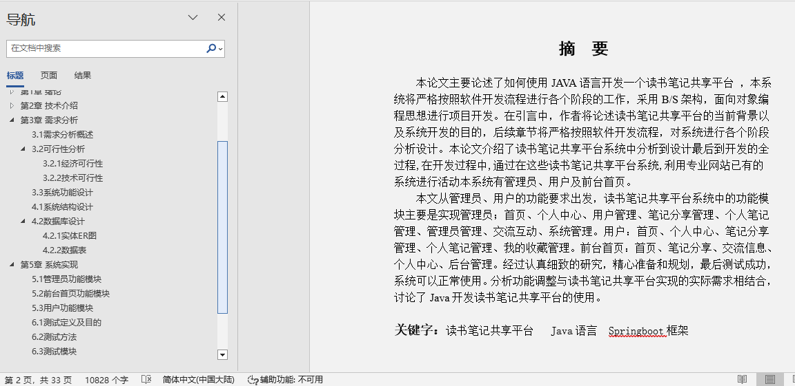

## 学生读书笔记共享(程序+报告)

###  获取sql数据库文件: 从戎源码网 (https://armycodes.com/) QQ: 386869957 QQ群: 377586148
###  所有系统地址: (https://github.com/YuLin-Coder/AllProjectCatalog) 
###  所有项目以及源代码本人均调试运行无问题 可支持远程安装部署调试、定制修改、代码讲解

## 项目介绍
学生读书笔记共享，系统包含两种角色：用户、管理员，系统分为前台和后台两大模块，主要功能如下：

管理员功能模块包括：

管理员首页：通过首页可以访问首页、个人中心、用户管理、笔记分享管理、个人笔记管理、管理员管理、交流互动、公告信息等功能模块。
用户管理：可以查看和管理用户的用户名、姓名、性别、头像、手机、邮箱、兴趣标签等信息，并进行详情查看、删除和修改操作。
笔记分享管理：可以查看笔记的名称、类型、标签、图片、分享日期、用户名、邮箱、审核回复、审核状态等信息，并进行详情查看、删除和修改操作。
管理员管理：可以查看管理员的索引、用户名、密码、角色等信息，并进行详情查看、删除和修改操作。
个人笔记管理：可以查看笔记的名称、类型、标签、图片、发布日期、用户名、邮箱等信息，并进行详情查看、删除和修改操作。
交流互动：可以查看帖子的标题、用户名、状态、操作等信息，并进行详情查看、删除和修改操作。
公告信息：可以查看公告的索引、标题、简介、图片、操作等信息，并进行详情查看、删除和修改操作。

2 前台首页功能模块
前台首页功能模块包括：

首页：展示系统的主要内容和功能。
登录、用户注册：用户可以填写用户名、姓名、性别、头像、手机、邮箱、兴趣标签等信息进行注册。
笔记分享：用户可以通过填写笔记的名称、类型、标签、图片、分享日期、用户名、邮箱、审核回复、审核状态等信息进行搜索和添加。
交流互动：用户可以通过填写帖子标题、用户名、状态、操作等信息进行公开或私人操作。

3 用户功能模块
用户功能模块包括：

用户首页：可以查看首页、个人中心、笔记分享管理、个人笔记管理、我的收藏管理等信息。
个人信息：用户可以填写和更新用户名、姓名、性别、头像、手机、邮箱、兴趣标签等信息。
笔记分享管理：可以查看笔记的名称、类型、标签、图片、分享日期、用户名、邮箱、审核回复、审核状态等信息，并进行详情查看、修改或删除操作。
个人笔记管理：可以查看笔记的名称、类型、标签、图片、发布日期、用户名、邮箱等信息，并进行操作。

## 项目技术
- 编程语言：Java
- 数据库：MySQL
- 项目管理工具：Maven
- 前端技术：HTML、CSS、JavaScript、Vue
- 后端技术：Spring、SpringMVC、MyBatis

## 运行环境
- JDK版本：JDK1.8及以上
- 开发工具：IDEA、Ecplise、Myecplise都可以
- 数据库: MySQL5.7及以上
- Maven：maven3.0及以上
- Node：14.14.0及以上

## 运行截图

